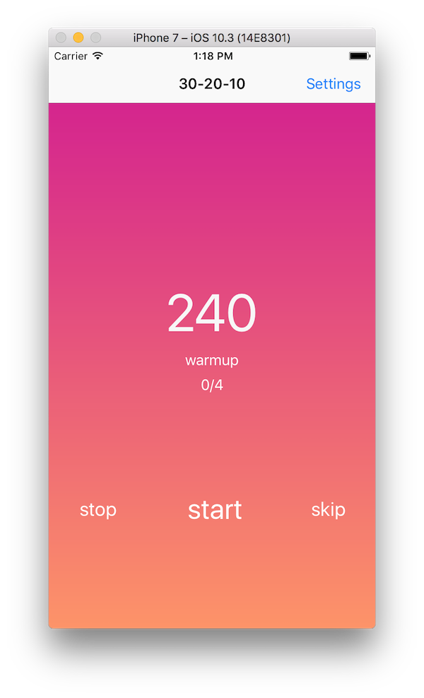
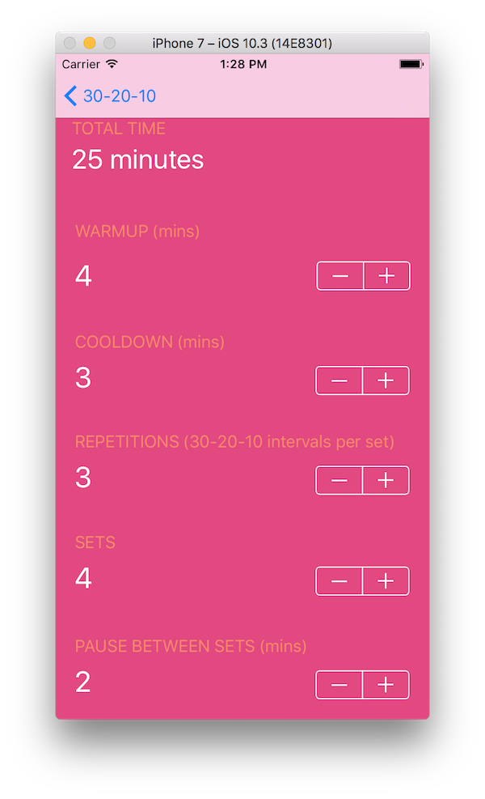

# 30-20-10

## Inspiration
This iOS app implements the 30-20-10 HIIT training routine as described in the NYTimes article ["A way to get fit and also have fun."](https://well.blogs.nytimes.com/2015/07/29/a-way-to-get-fit-and-also-have-fun/) I wanted a simple app for this that would be able to run in the background so I could switch up my music, or use other apps while working out.

## How to use
The app has a default 30-20-10 workout already configured. To use, press "start" to start your workout; the app will cue you to switch to jogging, running, or sprinting.
You can always skip a segment by pressing "skip," pause the workout with "pause" or stop the workout entirely with "stop."

### Background permission
The app asks for permission to run in the background so that you can use it while listening to music or using other apps.

## Settings
You can configure your 30-20-10 workout to include as many repetitions of 30-20-10 per set, number of sets, rest between sets, as well as the duration of the warmup and cooldown.

